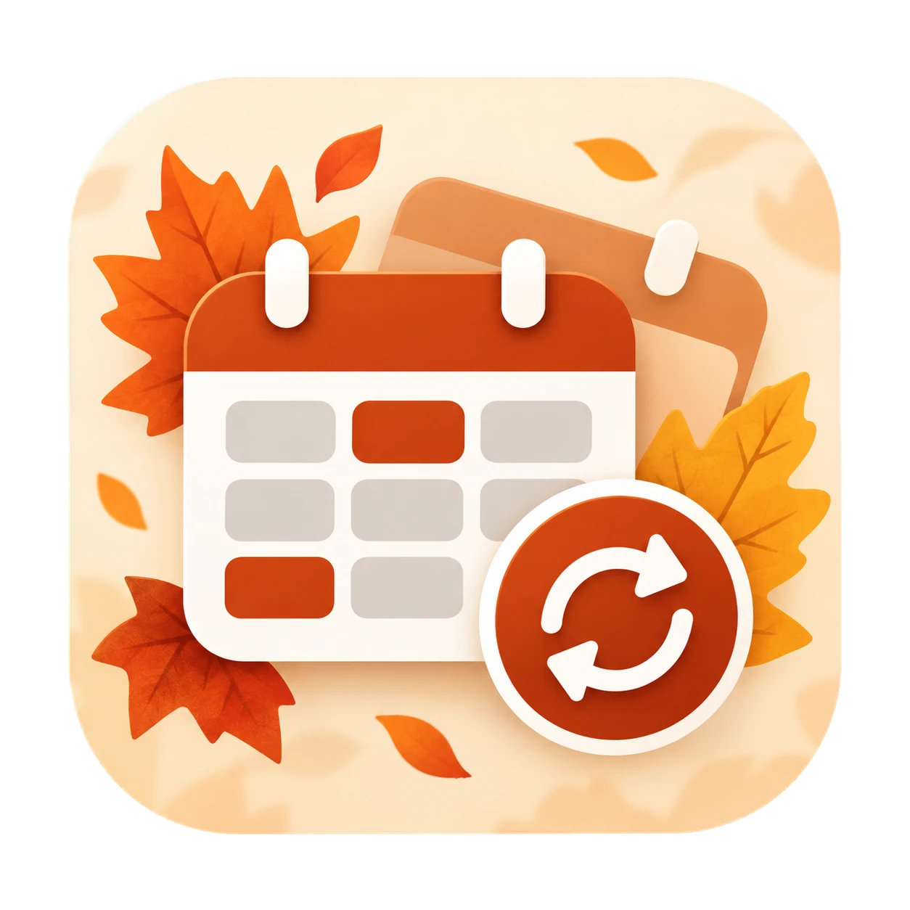
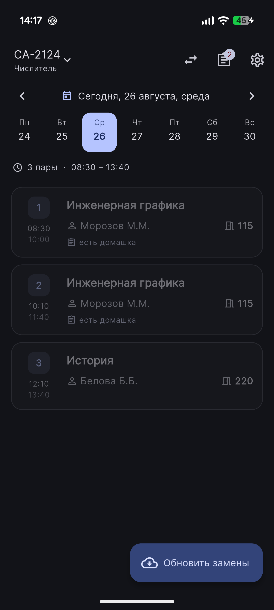
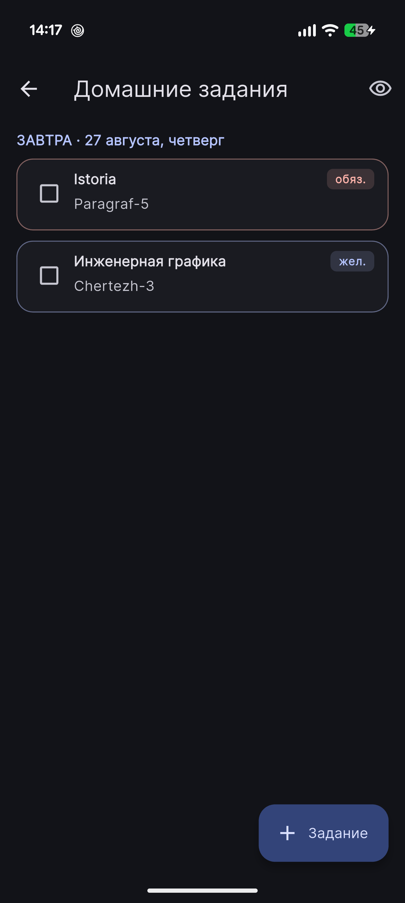
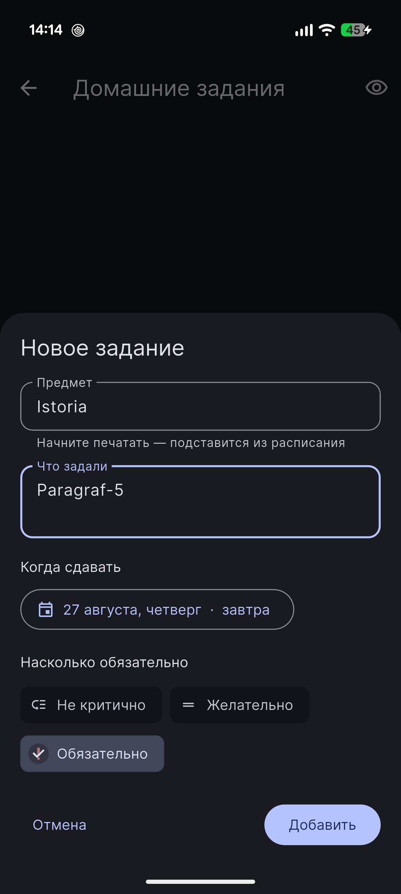
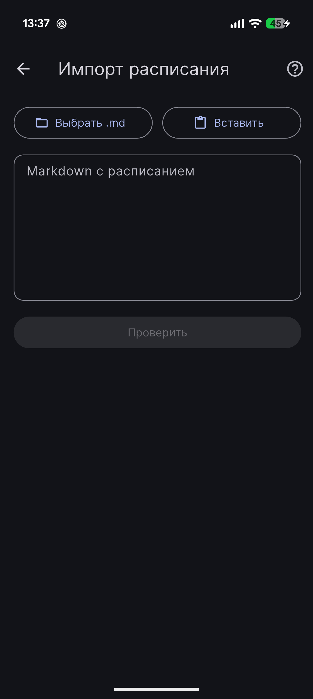

<p align="center">
  
</p>

<h1 align="center">Расписание</h1>

<p align="center">
  Расписание пар, которое само подтягивает замены.<br>
  Для колледжей и техникумов, где завуч выкладывает замены документом Word.
</p>

<p align="center">
  <a href="https://apps.obtainium.imranr.dev/redirect?r=obtainium://add/https://github.com/ElectWRT/raspisanie_app"></a>
</p>

<p align="center">
  <a href="../../releases/latest">Скачать APK</a> ·
  <a href="#установка">Установка</a> ·
  <a href="#другое-учебное-заведение">Своё учебное заведение</a> ·
  <a href="../../issues/new">Сообщить об ошибке</a>
</p>

---

Утром не нужно открывать сайт колледжа, искать документ с заменами и
выискивать в таблице свою группу. Приложение делает это само: находит
документ, разбирает его и показывает день уже с заменами — какая пара
снята, какая перенесена, в какой аудитории. А если замены появились,
пока телефон лежал в кармане, пришлёт уведомление.

Изначально сделано для [Хабаровского автомеханического колледжа](https://www.khamk.ru)
и настроено на него по умолчанию, но работает с любым заведением, которое
выкладывает замены файлом `.docx` — см. [Другое учебное заведение](#другое-учебное-заведение).

## Принципы

- **Всё на телефоне.** У приложения нет своего сервера, аккаунтов и
  регистрации. Расписание, отметки и домашка хранятся в базе на устройстве.
- **В сеть — только по делу.** Приложение обращается к сайту вашего
  учебного заведения и к облаку, где лежит документ с заменами. Ещё один раз
  скачивает шрифт Inter с Google Fonts и дальше хранит его на телефоне.
  На GitHub — только когда вы сами нажимаете ссылку. Ни аналитики, ни
  трекеров, ни рекламы.
- **Бесплатно и открыто.** Код целиком здесь. Продавать приложение или брать
  плату за доступ нельзя — см. [лицензию](#лицензия).
- **Не мешает.** Напоминания только о том, что вы включили; анимации
  отключаются одним переключателем и сами, если в Android включено
  «Удалить анимации».

> Если на телефоне включено системное резервное копирование Android в Google,
> система может сохранять туда и данные приложения — это настройка телефона,
> а не приложения.

## Возможности

### Расписание

- День целиком: время пар по звонкам, свайп между днями, точки на днях
  недели, где есть замены.
- Числитель и знаменатель, подгруппы — пары чужой подгруппы можно скрыть.
- Текущая пара подсвечивается, прошедшие приглушаются.
- Несколько групп в одной базе с переключением в шапке.
- Звонки — несколько наборов по дням недели: суббота обычно звонит иначе.
- **Совмещённые пары**: если у той же пары в то же время тот же преподаватель
  ведёт другую группу, на карточке появится «Совмещёнка с группой ИС-2301».

### Замены

- Приложение само находит на странице заведения ссылки на документы замен,
  понимает дату и номер корпуса и берёт нужный.
- Понимает прямые ссылки на файл и публичные ссылки облака Mail.ru.
- Если сайт недоступен или поменялся — прямая ссылка в настройках или файл
  `.docx` с телефона.
- Заменённая пара показывает, что стояло раньше; снятые и добавленные пары
  помечены отдельно. Лог «было → стало» — на экране всех замен дня.
- **Фоновая проверка**: раз в 1, 3, 6 или 12 часов приложение само заглядывает
  на сайт и сообщает «Замены на сегодня» или «Замены на завтра», если для
  вашей группы появилось что-то новое.
- «Диагностика разбора» показывает, что именно приложение прочитало в
  документе, — помогает, если формат оказался непривычным.

### Посещаемость

- Отметка на каждой паре одним тапом: был, пропустил, по уважительной.
- Статистика пропусков по предметам, худшие — сверху.
- **Можно ли пропустить день**: над расписанием вердикт «Можно»,
  «Не стоит» или «Критично». Учитывает, сколько уже пропущено по каждому
  предмету, профильный ли он и замены — снятая пара в расчёт не идёт.
  Лимиты пропусков настраиваются.
- **Профиль предмета**: профильный или нет и что взять на пару — ноутбук,
  планшет, форму. «Взять: …» показывается прямо на карточке.
- Вечером — напоминание отметить пары, если что-то осталось без отметки.

### Домашние задания

- Что задали, к какому числу и насколько важно: обязательно, желательно,
  не критично.
- Напоминание за 1, 2, 3 или 7 дней в выбранный час. О некритичных не
  напоминает, чтобы уведомления не превращались в шум.
- На карточке пары видно, есть ли по предмету несданное задание.

### Уведомления

- Перед парой — за 5, 10, 15 или 30 минут, по желанию с точным временем.
- О домашке, о неотмеченных парах, о новых заменах.
- Тап по уведомлению открывает то, о чём оно: нужный день, задание или
  экран замен.
- Всё планируется на телефоне и переживает перезагрузку.

### Оформление

- Светлая, тёмная и системная тема; цвета из обоев (Android 12+) или один из
  8 акцентов; чёрный фон для AMOLED; масштаб текста; компактные карточки.
- **По сезону**: осенью падают листья, зимой снег, весной лепестки, летом
  поднимаются тёплые блики. Всё летит за карточками и не мешает читать.
- **Новогодние каникулы** (с 20 декабря по 10 января): гирлянда над
  расписанием, поздравление и снег погуще.
- Число летящих частиц подбирается под телефон по тому, как быстро он рисует
  кадры, — на слабом устройстве их меньше, чтобы не было рывков.

### Данные

- Резервная копия одним файлом `.json`: расписание, звонки, замены, домашка,
  отметки, профили предметов и настройки. Перед восстановлением — предпросмотр.
- Восстанавливайте только копии, которым доверяете: вместе с настройками
  копия переносит и адрес, откуда приложение берёт замены.

## Как выглядит

<table>
  <tr>
    <td align="center" width="25%">
      <br>
      <sub><b>Расписание дня</b></sub>
    </td>
    <td align="center" width="25%">
      <br>
      <sub><b>Домашние задания</b></sub>
    </td>
    <td align="center" width="25%">
      <br>
      <sub><b>Новое задание</b></sub>
    </td>
    <td align="center" width="25%">
      <br>
      <sub><b>Импорт расписания</b></sub>
    </td>
  </tr>
</table>

<sub>Скриншоты версии 1.2 — с тех пор появились посещаемость, совмещённые пары
и сезонное оформление.</sub>

## Установка

Только Android.

### Через Obtainium — с автообновлением

[Obtainium](https://github.com/ImranR98/Obtainium) следит за релизами на GitHub
и сам ставит новые версии. Нажмите значок **Get it on Obtainium** вверху
страницы — с телефона, где Obtainium уже стоит; если его нет, страница
предложит скачать. То же есть в приложении: **Настройки → О приложении →
Обновлять через Obtainium**.

### Вручную

Скачайте APK из [последнего релиза](../../releases/latest) и установите.

Новые версии встают поверх старых — удалять приложение не нужно, данные
сохраняются: все сборки подписаны одним ключом.

## Первая настройка

1. **Расписание.** Настройки → «Формат файла и промпт». Впишите название
   группы, скопируйте промпт и отправьте любой нейросети вместе с фото или
   таблицей расписания. Ответ вставьте на экране импорта. В предпросмотре
   видно, какие группы распознаны, — название можно поправить перед
   сохранением. Формат можно писать и руками: [`docs/SCHEDULE_FORMAT.md`](docs/SCHEDULE_FORMAT.md),
   пример — [`samples/schedule_example.md`](samples/schedule_example.md).
2. **Группа и подгруппа** — в шапке главного экрана и в настройках.
3. **Замены.** Для ХАМК ничего делать не нужно. Для другого заведения —
   см. ниже.
4. **Уведомления и фоновая проверка** — в настройках, по желанию.

Ещё одна группа добавляется так же — импортом её расписания. Расписание
других групп при этом не трогается.

## Другое учебное заведение

Подойдёт, если замены выкладываются **документом `.docx`** — на странице сайта
или в облаке Mail.ru.

1. В **Настройках → Источник замен** укажите адрес страницы, где появляются
   ссылки на замены. Приложение ищет ссылки со словом «замены» в подписи,
   дату — в тексте ссылки или имени файла, номер корпуса — в подписи вида
   «Корпус № 1».
2. Если автоматический поиск не справился — вставьте **прямую ссылку** на
   документ или загрузите файл с телефона.
3. В документе должна быть таблица с заголовком. Колонки узнаются по
   словам в шапке, порядок не важен:

   | Колонка | Слова в заголовке |
   |---|---|
   | Группа | группа, гр. |
   | Номер пары | пара, урок, занятие, №, номер |
   | Предмет | предмет, дисциплина, наименование |
   | Преподаватель | преподаватель, ФИО, педагог, учитель |
   | Аудитория | аудитория, кабинет, ауд, каб |
   | Примечание | примечание, комментарий |

   Объединённые ячейки группы и строки-разделители вроде «2 курс» не мешают.
   Снятая пара распознаётся по словам «снята», «отмена», «нет», «гуляют».

Если документ разобрался не так — откройте **Диагностику разбора** и
[создайте issue](../../issues/new): пример документа поможет поддержать ваш
формат.

## Как это устроено

```
страница заведения ──► ссылки на документы ──► .docx ──► разбор таблицы ──┐
  (дата, корпус)         (сегодня и дальше)                               ▼
                                                                    SQLite на телефоне
основное расписание (.md) ──► импорт ─────────────────────────────────────┤
                                                                           ▼
                        расписание дня = пары + замены + совмещённые с другими группами
                                                   │
                         отметки посещения ────────┴──► вердикт «можно ли пропустить»
```

## Для разработчиков

**Стек:** Flutter, BLoC (Cubit), drift (SQLite), GetIt, dio, html, xml + archive
для `.docx`, flutter_local_notifications, WorkManager.

```
lib/
  core/
    database/       таблицы drift: пары, замены, домашка, отметки, профили предметов
    background/     фоновая проверка замен (WorkManager)
    notifications/  планирование уведомлений и переход по тапу
    backup/         резервная копия в JSON
    settings/       настройки (SharedPreferences)
    theme/, utils/, error/
  features/
    schedule/       расписание, импорт .md, слияние с заменами, совмещённые пары
    substitutions/  поиск ссылок, скачивание и разбор .docx
    attendance/     отметки, статистика, вердикт «можно ли пропустить»
    homework/       домашние задания
    seasons/        сезонное оформление и подбор плотности частиц
    settings/       экраны настроек
```

```bash
flutter pub get
```

```bash
dart run build_runner build --delete-conflicting-outputs
```

```bash
flutter test
```

```bash
flutter build apk --release --target-platform android-arm64
```

Кодогенерация нужна после изменений в `lib/core/database/tables.dart`.

Несколько решений, которые стоит знать до правок:

- **База открывается в основном изоляте.** Фоновый изолят drift на части
  устройств молча не поднимался — приложение висело на заставке без ошибок.
- **Слияние замен, вердикт пропусков, поиск совмещённых пар и подбор
  плотности частиц — чистые функции** без базы и интерфейса, покрытые тестами.
- **Парсер терпим к вёрстке:** колонки ищутся по заголовкам, пустая ячейка
  группы наследуется от строки выше, непонятные строки попадают в диагностику,
  а не роняют разбор.
- **Фоновая проверка качает все документы с сегодняшнего дня**, а не один
  ближайший: замены на завтра выкладывают, пока висит сегодняшний.

## Известные ограничения

- Только Android, сборка под `arm64`.
- Замены — только `.docx`; старый `.doc` и PDF не поддерживаются.
- Автопоиск ссылок проверен на сайте ХАМК; на другом сайте может
  понадобиться прямая ссылка.
- Фоновую проверку запускает Android по своему расписанию — не чаще раза
  в 15 минут; режим экономии батареи и оболочки некоторых производителей
  могут её откладывать.
- Основное расписание задаётся импортом Markdown — редактора пар в приложении нет.
- Совмещённая пара «замена у нас, у них обычная пара» находится, только если
  импортировано расписание той группы.

## Обратная связь

Нашли ошибку или хотите, чтобы приложение поддержало ваш колледж, —
[создайте issue](../../issues/new). Нравится приложение — поделитесь с
одногруппниками и поставьте звезду.

## Лицензия

Свободное некоммерческое использование: приложение можно бесплатно
использовать, копировать и распространять; продавать его или брать плату за
доступ нельзя. Подробности — в [`LICENSE`](LICENSE).

Разработано [ElectWRT](https://github.com/ElectWRT) ·
[TheSkippersTeam](https://github.com/TheSkippersTeam)
